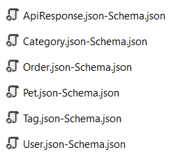

# Creating a Dynamic OpenAPI Client

- [Creating a Dynamic OpenAPI Client](#creating-a-dynamic-openapi-client)
  - [The road to the Microsoft.OpenApi library](#the-road-to-the-microsoftopenapi-library)
  - [Getting Claude.ai's code to work](#getting-claudeais-code-to-work)
  - [Creating my OpenApiSchemaValidator](#creating-my-openapischemavalidator)
  - [Links](#links)

Recently, I needed to integrate a system that generates raw JSON with an external API. Usefully, I had an OpenAPI specification for the API. [OpenAPI](https://swagger.io/specification/) is a specification for machine-readable interface files for describing, producing, consuming, and visualising RESTful web services. It is also well-known as its previous name of Swagger. You can see and interact with an example specification via the online [Swagger Editor](https://editor.swagger.io/).

The specification includes definitions of the objects used by the API. For example, in the [Petstore](https://petstore.swagger.io/) example the method to add a pet has a payload that takes a `Pet` object as a its payload.

```yaml
Pet:
  required:
    - name
    - photoUrls
  type: object
  properties:
    id:
      type: integer
      format: int64
    name:
      type: string
    category:
      $ref: "#/components/schemas/Category"
    photoUrls:
      type: array
      items:
        type: string
```

What I wanted to do was use this information to validate the raw JSON being generated, before it was sent to the external API. The question was how?

## The road to the Microsoft.OpenApi library

My first thought was to manually parse the OpenAPI specification. So I asked [Claude.ai](https://claude.ai):

> Please generate a C# method that takes a Swagger definition in JSON and an operation id and returns a JSON schema for the operation request body.

Claude obliged, but the resulting code was far from promising.

```csharp
using JsonDocument doc = JsonDocument.Parse(swaggerJson);
  JsonElement root = doc.RootElement;

  // Iterate through paths
  foreach (JsonProperty pathProp in root.GetProperty("paths").EnumerateObject())
  {
      foreach (JsonProperty methodProp in pathProp.Value.EnumerateObject())
      {
          if (methodProp.Value.TryGetProperty("operationId", out JsonElement opIdElement)
              && opIdElement.GetString() == operationId)
          {
              // Found the operation, now extract the request body schema
              if (methodProp.Value.TryGetProperty("requestBody", out JsonElement requestBody)
                  && requestBody.TryGetProperty("content", out JsonElement content))
              {
                  foreach (JsonProperty contentType in content.EnumerateObject())
                  {
                      if (contentType.Value.TryGetProperty("schema", out JsonElement schema))
                      {
```

It occurred to me that my prompt was not broad enough. I was assuming a certain solution. So instead, I tried a higher level request.

> I am using .NET Framework and C#. I have a Swagger definition for an API. How can I extract the JSON Schema for the request and response body for each operation in the definition?

And the response led me to the Microsoft.OpenApi library.

> To extract the JSON Schema for request and response bodies from a Swagger definition in a .NET Framework and C# environment, you can use the Microsoft.OpenApi library. This library provides tools to parse and manipulate OpenAPI (formerly known as Swagger) documents.

As I could see from the generated code, this looked far more like it.

```csharp
var openApiDocument =
    new OpenApiStreamReader().Read(
        File.OpenRead(swaggerFilePath), out var diagnostic);

foreach (var path in openApiDocument.Paths)
{
    foreach (var operation in path.Value.Operations)
    {
        var operationType = operation.Key.ToString();
        var operationId = operation.Value.OperationId;

        // Extract request body schema
        if (operation.Value.RequestBody != null &&
            operation.Value.RequestBody.Content.TryGetValue(
                "application/json", out var requestMediaType))
        {
            var requestSchema = requestMediaType.Schema;
```

## Getting Claude.ai's code to work

This was great, but it only had one snag. It didn't work. When I tried running the code I got the following exception.

```text
Newtonsoft.Json.JsonSerializationException
  HResult=0x80131500
  Message=Self referencing loop detected for property 'HostDocument' with type 'Microsoft.OpenApi.Models.OpenApiDocument'. Path 'Properties.category.Reference.HostDocument.Paths['/pet/{petId}/uploadImage'].Operations.Post.Tags[0].Reference'.
  Source=Newtonsoft.Json
```

The problem lied with the following line.

```csharp
var schemaData = JsonConvert.SerializeObject(openApiSchema);
```

Claude.ai had predicted that something called `OpenApiSchema` was a serializable JSON schema. It turns out that it isn't, so I had to go back to some old-fashioned searching on [StackOverflow](https://stackoverflow.com/). My search turned up the following question, [Get the JSON Schema's from a large OpenAPI Document OR using NewtonSoft and resolve refs](https://stackoverflow.com/questions/71960630/get-the-json-schemas-from-a-large-openapi-document-or-using-newtonsoft-and-reso). The accepted answer had the following code (slightly abbreviated for this post).

```csharp
var reader = new OpenApiStreamReader();
var result =
    await reader.ReadAsync(new FileStream(file.FullName, FileMode.Open));

foreach (var schemaEntry in result.OpenApiDocument.Components.Schemas)
{
    var schemaFileName = schemaEntry.Key + ".json";
    var outputPath =
        Path.Combine(outputDir, schemaFileName + "-Schema.json");

    using var fileStream = new FileStream(outputPath, FileMode.CreateNew);
    using var writer = new StreamWriter(fileStream);

    var writerSettings =
        new OpenApiWriterSettings()
        {
            InlineLocalReferences = true,
            InlineExternalReferences = true
        };

    schemaEntry.Value
        .SerializeAsV2WithoutReference(
            new OpenApiJsonWriter(writer, writerSettings));
}
```

Sure enough, when I ran this code against the Petstore OpenAPI document, it successfully created the following schema files:



Opening up `User.json-Schema.json`, I could see that the contents looked promising too.

```json
{
  "type": "object",
  "properties": {
    "id": {
      "format": "int64",
      "type": "integer"
    },
    "petId": {
      "format": "int64",
      "type": "integer"
    },
    "quantity": {
      "format": "int32",
      "type": "integer"
    },
    "shipDate": {
      "format": "date-time",
      "type": "string"
    },
    "status": {
      "description": "Order Status",
      "enum": ["placed", "approved", "delivered"],
      "type": "string"
    },
    "complete": {
      "type": "boolean"
    }
  },
  "xml": {
    "name": "Order"
  }
}
```

The key here was the use of the `SerializeAsV2WithoutReference` method with the `OpenApiJsonWriter` and `OpenApiWriterSettings`. Together they control how an `OpenApiSchema` instance is serialized. In this case, we want to inline all references to get a self-contained schema.

```csharp
var writerSettings =
    new OpenApiWriterSettings()
    {
        InlineLocalReferences = true,
        InlineExternalReferences = true
    };

schemaEntry.Value
    .SerializeAsV2WithoutReference(
        new OpenApiJsonWriter(writer, writerSettings));
```

Now I had a way of extracting the schemas, I could move on to my ultimate aim of using them to validate my dynamically-created requests.

## Creating my OpenApiSchemaValidator

TODO

```csharp
var validator = 
    new OpenApiSchemaValidator(
        new FileStream("petstore.swagger.json", FileMode.Open));

var validationResult = 
    await validator.ValidateOperationBodyAsync(
        operationId: "addPet", bodyJson: petJson);

if (validationResult.IsValid)
{
    Console.WriteLine("Request JSON is valid");
}
else
{
    Console.WriteLine(
        $"Request JSON had the following errors - " +
        $"{string.Join(", ", validationResult.Errors)}");
}
```

## Links

- [OpenAPI Specification](https://swagger.io/specification/)
