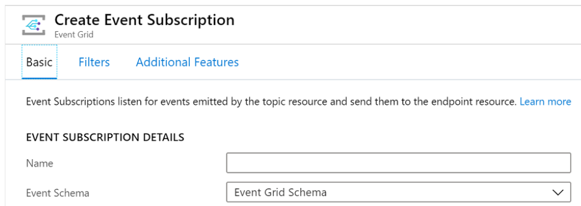

# Reacting to Blob Storage events

## Dilemma:

- Deprecated polling approach vs. Event Grid push approach
- React directly to events vs. writing to a queue
  - Need to test the failure scenario with dead letter queues and replaying
  - If writing to a queue, then Storage queues vs. Service Bus queues
    - [Storage queues and Service Bus queues - compared and contrasted](https://learn.microsoft.com/en-us/azure/service-bus-messaging/service-bus-azure-and-service-bus-queues-compared-contrasted)
    - [What is Azure Queue Storage?](https://learn.microsoft.com/en-us/azure/storage/queues/storage-queues-introduction)

## Further thoughts:

- Should we implement idempotency at the Validate and Store stage?
  - Or should we always store and de-dupe at the forward stage? E.g. using a hash of the message content before we write to the next queue?
  - What should we use for the list of hashes? Cosmos DB?

Could have:

- DedupeAndQueueFunction
- InvokeEndpointFunction (This might want to dedupe as well, but can do it on message id and not hash)

## Initial findings

- How to debug locally?
  - Can you hook into local events? Not that I could see.
  - [Debugging Azure Function Event Grid Triggers Locally](https://harrybellamy.com/posts/debugging-azure-function-event-grid-triggers-locally/)

```csharp
// Default URL for triggering event grid function in the local environment.
// http://localhost:7071/runtime/webhooks/EventGrid?functionName=EventGridFunction
```

- Didn't work until I found:

  - [Unable to debug Event Grid Trigger Azure function locally](https://stackoverflow.com/questions/77543838/unable-to-debug-event-grid-trigger-azure-function-locally)
  - [Azure Event Grid Trigger function is not working locally](https://github.com/Azure/Azure-Functions/issues/2426)

- See also [Test your Event Grid handler locally](https://learn.microsoft.com/en-us/azure/communication-services/how-tos/event-grid/local-testing-event-grid)
  - > To help with testing, we show you how to use Postman to trigger your Azure Function with a payload that mimics the Event Grid event.

```json
{
  "profiles": {
    "WebhookFunctionApp": {
      "commandName": "Project",
      "commandLineArgs": "--port 7089",
      "launchBrowser": false
    }
  }
}
```

- [CloudEvents v1.0 schema with Azure Event Grid](https://learn.microsoft.com/en-us/azure/event-grid/cloud-event-schema)

  - > Azure Event Grid natively supports events in the JSON implementation of CloudEvents v1.0 and HTTP protocol binding. CloudEvents is an open specification for describing event data. CloudEvents simplifies interoperability by providing a common event schema for publishing, and consuming cloud based events. This schema allows for uniform tooling, standard ways of routing & handling events, and universal ways of deserializing the outer event schema. With a common schema, you can more easily integrate work across platforms.

  - > The headers values for events delivered in the CloudEvents schema and the Event Grid schema are the same except for `content-type`. For CloudEvents schema, that header value is `"content-type":"application/cloudevents+json; charset=utf-8"`. For Event Grid schema, that header value is `"content-type":"application/json; charset=utf-8"`.

- No Data content type: (null), Data schema: (null)

```text
[2024-11-10T09:30:13.886Z] Event type: Microsoft.Storage.BlobCreated, Event subject: blobServices/default/containers/{storage-container}/blobs/{new-file}
[2024-11-10T09:30:13.888Z] Data content type: (null), Data schema: (null)
[2024-11-10T09:30:13.890Z] Data: {"api":"PutBlockList","clientRequestId":"4c5dd7fb-2c48-4a27-bb30-5361b5de920a","requestId":"9aeb0fdf-c01e-0131-0922-9eb549000000","eTag":"0x8D76C39E4407333","contentType":"image/png","contentLength":30699,"blobType":"BlockBlob","url":"https://gridtesting.blob.core.windows.net/testcontainer/{new-file}","sequencer":"000000000000000000000000000099240000000000c41c18","storageDiagnostics":{"batchId":"681fe319-3006-00a8-0022-9e7cde000000"}}
```

- ## Q: How do we convert this to a typed event?

[Azure Event Grid trigger for Azure Functions](https://learn.microsoft.com/en-us/azure/azure-functions/functions-bindings-event-grid-trigger?tabs=python-v2%2Cisolated-process%2Cnodejs-v4%2Cextensionv3&pivots=programming-language-csharp)

> When running your C# function in an isolated worker process, you need to define a custom type for event properties. The following example defines a MyEventType class.

```csharp
public class MyEventType
{
    public string Id { get; set; }

    public string Topic { get; set; }

    public string Subject { get; set; }

    public string EventType { get; set; }

    public DateTime EventTime { get; set; }

    public IDictionary<string, object> Data { get; set; }
}
```

So I got:

```csharp
[Function(nameof(EventGridFunction))]
public void Run([EventGridTrigger] MyEventType myEvent)
```

- Q: Where is the schema set for the events set?

- A: [Create the subscription](https://learn.microsoft.com/en-us/azure/azure-functions/event-grid-how-tos?tabs=v2%2Cportal#create-a-subscription)

- 

- [Publish and Consume events with CloudEvents and Azure Event Grid](https://madeofstrings.com/2018/05/06/publish-and-consume-events-with-cloudevents-and-azure-event-grid/)

- [Azure Event Grid client library for .NET - version 4.27.0](https://learn.microsoft.com/en-us/dotnet/api/overview/azure/messaging.eventgrid-readme?view=azure-dotnet#receiving-and-deserializing-events)
  - [Receiving and Deserializing Events](https://learn.microsoft.com/en-us/dotnet/api/overview/azure/messaging.eventgrid-readme?view=azure-dotnet#receiving-and-deserializing-events)
    - > Note: if using Webhooks for event delivery of the Event Grid schema, Event Grid requires you to prove ownership of your Webhook endpoint before it starts delivering events to that endpoint. At the time of event subscription creation, Event Grid sends a subscription validation event to your endpoint, as seen below. Learn more about completing the handshake here: [Webhook event delivery](https://learn.microsoft.com/en-us/azure/event-grid/webhook-event-delivery).

## [cloudevents.io](https://cloudevents.io/)

Q: Do we want to get use CloudEvents at this point in time?

A: Probably not. That could be another post.

## [Using TryGetSystemEventData()](https://learn.microsoft.com/en-us/dotnet/api/overview/azure/messaging.eventgrid-readme?view=azure-dotnet#deserializing-event-data)

> If expecting mostly system events, it may be cleaner to switch on TryGetSystemEventData() and use pattern matching to act on the individual events. If an event is not a system event, the method will return false and the out parameter will be null.
>
> As a caveat, if you are using a custom event type with an EventType value that later gets added as a system event by the service and SDK, the return value of TryGetSystemEventData would change from false to true. This could come up if you are pre-emptively creating your own custom events for events that are already being sent by the service, but have not yet been added to the SDK. In this case, it is better to use the generic ToObjectFromJson<T> method on the Data property so that your code flow doesn't change automatically after upgrading (of course, you may still want to modify your code to consume the newly released system event model as opposed to your custom model).

```csharp
// If the event is a system event, TryGetSystemEventData will return the deserialized system event
if (egEvent.TryGetSystemEventData(out object systemEvent))
{
    switch (systemEvent)
    {
        case SubscriptionValidationEventData subscriptionValidated:
            Console.WriteLine(subscriptionValidated.ValidationCode);
            break;
        case StorageBlobCreatedEventData blobCreated:
            Console.WriteLine(blobCreated.BlobType);
            break;
        // Handle any other system event type
        default:
            Console.WriteLine(egEvent.EventType);
            // we can get the raw Json for the event using Data
            Console.WriteLine(egEvent.Data.ToString());
            break;
    }
}
else
{
    switch (egEvent.EventType)
    {
        case "MyApp.Models.CustomEventType":
            TestPayload deserializedEventData = egEvent.Data.ToObjectFromJson<TestPayload>();
            Console.WriteLine(deserializedEventData.Name);
            break;
        // Handle any other custom event type
        default:
            Console.Write(egEvent.EventType);
            Console.WriteLine(egEvent.Data.ToString());
            break;
    }
}```

